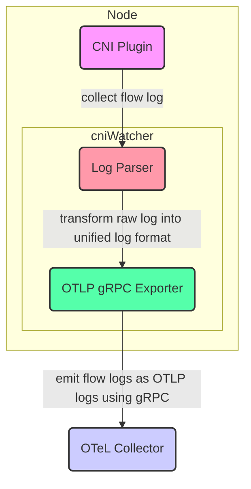

| **Feature Name** | cniWatcher                                                  |
| :--------------- | :-----------------------------------------------------------|
| **Start Date**   | Jun 19, 2026                                                |
| **Category**     | DaemonSet, Component, OpenTelemetry                         |
| **RFC PR**       | https://github.com/rancher-sandbox/network-enforcer/pull/22 |
| **State**        | **ACCEPTED**                                                |

- [Summary](#summary)
- [Motivation](#motivation)
  - [User Stories](#user-stories)
- [Detailed Design](#detailed-design)
  - [Architecture Overview](#architecture-overview)
  - [CNI-Specific Implementation Details](#cni-specific-implementation-details)
  - [Unified Schema](#unified-schema-policydenyevent)
  - [OpenTelemetry Export](#opentelemetry-export)
- [Architecture Diagram](#architecture-diagram)
- [Drawbacks](#drawbacks)
- [Alternatives](#alternatives)
- [Unresolved Questions](#unresolved-questions)

# Summary

`cniWatcher` is a Kubernetes DaemonSet that collects, normalizes, and exports network flow logs from various CNI (Container Network Interface) plugins, including `Amazon VPC CNI`, `Calico`, `Cilium`, and `Flannel`. It unifies these flow logs into a consistent data structure and exports them using the OpenTelemetry protocol.

# Motivation

Kubernetes environments support various CNI plugins across clusters or even within the same cluster over time. Each CNI plugin emits flow logs in different formats and locations, making it difficult to:
- Monitor and diagnose denied packets at the network level
- Correlate network policy violations across clusters
- Feed standardized network events into centralized security platforms

`cniWatcher` addresses this fragmentation by:
- Normalizing CNI flow logs into a single schema (`PolicyDenyEvent`)
- Exporting them in OpenTelemetry format for easy integration
- Supporting multi-CNI environments with plugin-specific collectors

## User Stories

### User Story 1: Platform SRE

> As a Platform SRE, I want to collect and monitor all network policy violations in my cluster so I can diagnose dropped packets and policy misconfigurations regardless of which CNI plugin is used.

### User Story 2: Security Analyst

> As a Security Analyst, I want a consistent log format of all denied network flows across namespaces and clusters, so I can build threat detection and compliance reports.

### User Story 3: Software Engineer

> As a software engineer, I want to collect these flow logs so that I can integrate this data for future security tooling development.

# Detailed design

## Architecture Overview

- **DaemonSet Deployment**: One pod per node to collect logs from local host sources
- **Modular Log Parsers**: Plugin-based system with specialized watchers for:    
    - Amazon VPC CNI (log file parsing)
    - Calico (via Goldmane gRPC API)
    - Cilium (via Hubble socket)
    - Flannel (log file parsing)
- **Unified Log Format**: Transform raw logs into a common `PolicyDenyEvent` struct
- **OpenTelemetry Exporter**: Emit flow logs as OTLP logs using gRPC to a configured OTeL collector

## CNI-Specific Implementation Details

### AWS VPC CNI Implementation

The AWS VPC CNI watcher parses network policy agent logs:

- **Prerequisites**:
  - AWS VPC CNI must have network policy support enabled via `enablePolicyEventLogs` environment variable
  - Network policy logs must be explicitly enabled in the CNI configuration
- **Log Format**: Processes JSON-formatted log entries with the following structure:
  ```json
  {
    "level": "info",
    "timestamp": "2026-06-18T19:00:48Z",
    "logger": "ebpf-client",
    "msg": "Flow Info:",
    "Src IP": "10.0.46.218",
    "Src Port": 33274,
    "Dest IP": "10.0.46.106",
    "Dest Port": 443,
    "Proto": "TCP",
    "Verdict": "DENY"
  }
  ```
- **Filtering**: Only processes log entries with `"Verdict": "DENY"`
- **Log Location**: Reads from `/var/log/aws-routed-eni/network-policy-agent.log`
- **Policy Deny Event Log Example**:
```
time=2026-06-18T00:06:10.930Z level=INFO msg="Processing policy deny event" timestamp=1781755570 cniType=aws-vpc protocol=TCP srcNamespace=test-ns srcName=client srcLabels="[run=client]" dstNamespace=test-ns dstName=server dstLabels="[run=server]"
```

### Calico Implementation

The Calico watcher uses the [Goldmane gRPC API](https://docs.tigera.io/calico/latest/observability/flow-logs-api) to access flow logs:

- **Prerequisites**:
  - Goldmane service must be deployed in the cluster
  - Goldmane provides the [flow logs API](https://github.com/projectcalico/calico/blob/master/goldmane/proto/api.proto) for accessing Calico flow logs
- **Flow Streaming**: Uses `FlowStreamRequest` with `Action_Deny` filter:
  ```go
  filter := &pb.Filter{
      Actions: []pb.Action{pb.Action_Deny},
  }
  req := &pb.FlowStreamRequest{
      StartTimeGte:        0,      // A value of zero means "now", as determined by the server at the time of request.
      Filter:              filter,
      AggregationInterval: 15,     // AggregationInterval defines both the frequency of streamed updates for each Flow, and the amount of time that FlowResult covers. It must always be 15s.
  }
  ```
- **Data Processing**: Extracts flow details from the Goldmane API response:
  - Flow timestamps (start/end time)
  - Byte and packet counts
  - Connection statistics
  - Source: Name, namespace, type, and labels
  - Destination: Name, namespace, type, labels and port
  - Action taken on the connection
  - Reporter (i.e., measured at source or destination)
  - Protocol of the connection (TCP, UDP, etc.)
  - Policy information including tier, namespace, name, action, and trigger
  - EnforcedPolicies shows the active dataplane policy rules traversed by this Flow
- **Calico NetworkPolicy Example**:
For Calico NetworkPolicy, the EnforcedPolicies will be presented in the raw flow log with name, namespace, and kind(`CalicoNetworkPolicy`) directly
```yaml
apiVersion: projectcalico.org/v3
kind: NetworkPolicy
metadata:
  name: deny-all
  namespace: test-ns
spec:
  selector: run == 'server'
  order: 2000
  ingress:
    - action: Deny
      source: {}
      destination: {}
  egress:
    - action: Deny
      source: {}
      destination: {}
  types:
    - Ingress
    - Egress
  ```
```
time=2026-06-18T00:27:45.001Z level=INFO msg="Processing policy deny event" timestamp=1781756865 cniType=calico protocol=tcp srcNamespace=test-ns srcName=client srcLabels="[run=client]" dstNamespace=test-ns dstName=server dstLabels="[run=server]" ingressEnforcedBy=[projectcalico.org/v3/CalicoNetworkPolicy/test-ns/deny-all]
  ```
- **K8s NetworkPolicy Example**:
For K8s NetworkPolicy, the EnforcedPolicies will be presented within trigger field in the raw flow log with name, namespace, and kind(`NetworkPolicy`)
```yaml
apiVersion: networking.k8s.io/v1
kind: NetworkPolicy
metadata:
  name: allow-only-tcp-8080
  namespace: test-ns
spec:
  podSelector:
    matchLabels:
      run: server
  policyTypes:
    - Ingress
  ingress:
    - from:
        - podSelector:
            matchLabels:
              run: client
      ports:
        - protocol: TCP
          port: 8080
  ```
```
time=2026-06-18T00:22:45.021Z level=INFO msg="Processing policy deny event" timestamp=1781756565 cniType=calico protocol=tcp srcNamespace=test-ns srcName=client srcLabels="[projectcalico.org/namespace=test-ns projectcalico.org/orchestrator=k8s projectcalico.org/serviceaccount=default run=client]" dstNamespace=test-ns dstName=server dstLabels="[projectcalico.org/namespace=test-ns projectcalico.org/orchestrator=k8s projectcalico.org/serviceaccount=default run=server]" ingressEnforcedBy=[networking.k8s.io/v1/NetworkPolicy/test-ns/allow-only-tcp-8080]
  ```

### Cilium Implementation

The Cilium watcher connects to the Hubble API endpoint and streams policy verdict events:

- **Connection**: Establishes gRPC connection to Hubble endpoint (default: `unix:///var/run/cilium/hubble.sock`)
- **Flow Filtering**: Filters for `MessageTypePolicyVerdict` events with drop reasons:
  - `DropReason_POLICY_DENIED`
  - `DropReason_POLICY_DENY`
- **Policy Identification**:
  - `EgressDeniedBy`: The CiliumNetworkPolicies denying the egress of the flow
  - `IngressDeniedBy`: The CiliumNetworkPolicies denying the ingress of the flow
- **Data Extraction**: Extracts detailed metadata including:
  - Source/destination namespaces, pod names, and labels
  - Source/destination workload information
  - Protocol details (TCP, UDP, ICMP, SCTP)
  - Port information
  - Policy references that caused the denial
- **ingressDeny Example**:
```yaml
apiVersion: cilium.io/v2
kind: CiliumNetworkPolicy
metadata:
  name: deny-all-ingress-from-client
  namespace: test-ns
spec:
  endpointSelector:
    matchLabels:
      run: server
  ingressDeny:
  - fromEndpoints:
    - matchLabels:
        run: client
  ```
```
time=2026-06-18T14:01:46.746Z level=INFO msg="Processing policy deny event" timestamp=1781805706 cniType=cilium protocol=TCP srcNamespace=test-ns srcName=client srcLabels="[k8s:io.cilium.k8s.namespace.labels.kubernetes.io/metadata.name=test-ns k8s:io.cilium.k8s.policy.cluster=kubernetes k8s:io.cilium.k8s.policy.serviceaccount=default k8s:io.kubernetes.pod.namespace=test-ns k8s:run=client]" dstNamespace=test-ns dstName=server dstLabels="[k8s:io.cilium.k8s.namespace.labels.kubernetes.io/metadata.name=test-ns k8s:io.cilium.k8s.policy.cluster=kubernetes k8s:io.cilium.k8s.policy.serviceaccount=default k8s:io.kubernetes.pod.namespace=test-ns k8s:run=server]" ingressEnforcedBy=[cilium.io/v2/CiliumNetworkPolicy/test-ns/deny-all-ingress-from-client]
  ```
- **egressDeny Example**:
```yaml
apiVersion: cilium.io/v2
kind: CiliumNetworkPolicy
metadata:
  name: deny-all-egress-to-server
  namespace: test-ns
spec:
  endpointSelector:
    matchLabels:
      run: client
  egressDeny:
  - toEndpoints:
    - matchLabels:
        run: server
  ```
```
time=2026-06-18T14:00:02.799Z level=INFO msg="Processing policy deny event" timestamp=1781805602 cniType=cilium protocol=TCP srcNamespace=test-ns srcName=client srcLabels="[k8s:io.cilium.k8s.namespace.labels.kubernetes.io/metadata.name=test-ns k8s:io.cilium.k8s.policy.cluster=kubernetes k8s:io.cilium.k8s.policy.serviceaccount=default k8s:io.kubernetes.pod.namespace=test-ns k8s:run=client]" dstNamespace=test-ns dstName=server dstLabels="[k8s:io.cilium.k8s.namespace.labels.kubernetes.io/metadata.name=test-ns k8s:io.cilium.k8s.policy.cluster=kubernetes k8s:io.cilium.k8s.policy.serviceaccount=default k8s:io.kubernetes.pod.namespace=test-ns k8s:run=server]" egressEnforcedBy=[cilium.io/v2/CiliumNetworkPolicy/test-ns/deny-all-egress-to-server]
  ```

### Flannel Implementation

The Flannel watcher will be only available on K3s with kube-router enabled(kube-router is enabled by default):

- **Prerequisites**: On the node of cniWatcher is deployed, install `ulogd` and changing it's configuration under `/etc/ulogd.conf`
  - Uncomment or add the line if it's not there `stack=log2:NFLOG,base1:BASE,ifi1:IFINDEX,ip2str1:IP2STR,print1:PRINTPKT,emu1:LOGEMU`
  - On the `[log2]` section, configure `group=100`
  - Make sure the `[emu1]` section the output file location is `file="/var/log/ulog/syslogemu.log"`
- **Filtering**: Only processes log entries with `DROP by policy <policy-name/policy-namespace>`
- **Log Location**: Reads from `/var/log/ulog/syslogemu.log`
- **Policy Deny Event Log Example**:
```
time=2026-06-18T13:51:42.017Z level=INFO msg="Processing policy deny event" timestamp=1781805102 cniType=flannel protocol=TCP srcNamespace=test-ns srcName=client srcLabels="[run=client]" dstNamespace=test-ns dstName=server dstLabels="[run=server]" egressEnforcedBy=[networking.k8s.io/v1/NetworkPolicy/test-ns/allow-only-tcp-80]
```

## Unified Schema: PolicyDenyEvent

```go
type Policy struct {
	metav1.TypeMeta `json:",inline"`
	Name            string `json:"name"`
	Namespace       string `json:"namespace"`
}

type PolicyDenyEvent struct {
	Timestamp int64  `json:"timestamp"`
	NodeName  string `json:"node_name"`
	// e.g. "aws-vpc", "calico", "cilium", "flannel"
	CNIType string `json:"cni_type"`
	// "TCP", "UDP", "ICMP", "SCTP"
	Protocol     corev1.Protocol `json:"protocol"`
	SrcNamespace string          `json:"source_namespace"`
	SrcName      string          `json:"source_name"`
	SrcLabels    []string        `json:"source_labels"`
	DstNamespace string          `json:"destination_namespace"`
	DstName      string          `json:"destination_name"`
	DstLabels    []string        `json:"destination_labels"`
	SrcWorkloads []string        `json:"source_workloads,omitempty"`
	DstWorkloads []string        `json:"destination_workloads,omitempty"`
	// The K8s NetworkPolicies or CiliumNetworkPolicies denying the egress of the flow
	EgressEnforcedBy []Policy `json:"egress_enforced_by,omitempty"`
	// The K8s NetworkPolicies or CiliumNetworkPolicies denying the ingress of the flow
	IngressEnforcedBy []Policy `json:"ingress_enforced_by,omitempty"`
}
```

## OpenTelemetry Export

- Uses OpenTelemetry Go SDK for exporting events
- Configurable export options:
  - **Logs**: High-volume, detailed policy deny events
- Supports multiple export protocols:
  - gRPC (default)
  - HTTP/Protobuf
- Configurable batch size and export frequency

# Architecture Diagram



# Drawbacks

**Dependency on CNI Features & APIs**:
- The functionality of cniWatcher is heavily dependent on the specific CNI plugin's ability to expose flow logs or provide an accessible API (e.g., Goldmane for Calico, Hubble for Cilium). If a CNI plugin doesn't offer these capabilities or changes its API/log format, the corresponding watcher module will be ineffective or require significant updates.
- For AWS VPC CNI: 
  - There is only source/destination IPs, source/destination ports, and protocol are exposed.
  - Need to use source/destination IPs to retrieve source/destination endpoint information from K8s API server. 
- For Cilium: 
  - When enforcing vanilla Kubernetes' NetworkPolicy, cilium does not provide details about which policy denied a network communication. It still logs the deny message, but it does not tell which policy caused the rejection. Because of that, we must express network policies using Cilium's CRDs, plus we must use the `EgressDeniedBy` and `IngressDeniedBy` fields when defining the policy.
- For Flannel:
  - There is no reporter of the dropped packet, need K3s team's help to add additional information. Otherwise, we need to find a solution to determine the traffic direction. 

# Alternatives

# Unresolved Questions

**Performance Benchmarks**:
- What are the expected resource consumption (CPU, memory, network I/O) profiles for cniWatcher under various load conditions (e.g., high rate of policy deny events) for each supported CNI?
- What are the average latencies from event occurrence to OTel export?

**HostNetwork IPs**:
- For AWS VPC CNI and Flannel, need to use source/destination IPs to retrieve source/destination endpoint information from K8s API server.
- Multiple `hostNetwork: true` pods can run on the same node and share the node IP.
- These are not unique to pods.

**Multi-Network Interface Containers (Multus)**:
- The flow logs we consume are generally tied to the primary interface that the CNI manages. Violation occurred over secondary network interface might not be captured by `cniWatcher`.
- If secondary interfaces are managed by CNIs that do not expose flow logs, how do we monitor and collect policy deny events from secondary interfaces?
- How do we correlate policy violations across different network interfaces for the same pod?
